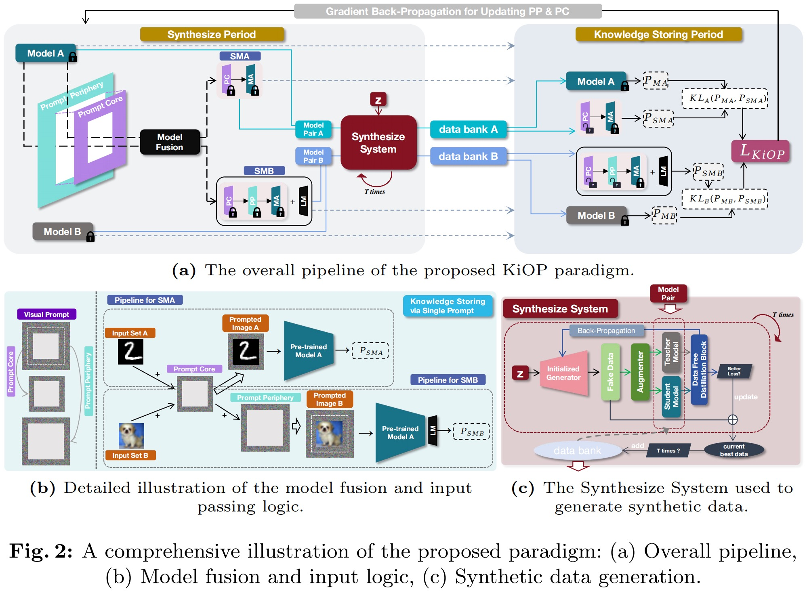

<div align="center">
<h1>Encapsulating Knowledge in One Prompt</h1>

<div>
Qi Li&emsp;Runpeng Yu&emsp;Xinchao Wang<sup>&dagger;</sup>
</div>
<div>
    LV-Lab, National University of Singapore&emsp;
    <sup>&dagger;</sup>corresponding author 
</div>
</div>

---


---

## Installation & Preparation

1. Clone the repo.

```
git clone https://github.com/LiQiiiii/Encapsulating-Knowledge-In-One-Prompt.git
```

```
cd Encapsulating-Knowledge-In-One-Prompt
```

2. Prepare the dataset and models. You can use your own models and dataset. For quick start, we provide several models and datasets, which can be downloaded directly from google drive:

```
gdown https://drive.google.com/file/d/18XDK2fdhCQuwGm4sJntfSvESpbZEv1bY/view?usp=drive_link
```

```
gdown https://drive.google.com/file/d/19o2EItRw-LOJUdjDf-mOz0zh0QalF8wj/view?usp=drive_link
```

```
unzip KiOP_models.zip
```

```
unzip KiOP_data.zip
```


---

## Training & Evaluation

We provide several scripts in ```./scripts```. For example, for running KiOP-B, you may use the ```KiOP_B.sh``` as follows. You can adjust the hyperparameters in the shell file to customize your setup:

```
sh ./scripts/KiOP_B.sh
```

## Citation

If you finding our work interesting or helpful to you, please cite as follows:

```
@misc{li2024...,
      title={Encapsulating Knowledge in One Prompt}, 
      author={Qi Li and Runpeng Yu and Xinchao Wang},
      year={2024},
      eprint={****.*****},
      archivePrefix={arXiv},
      primaryClass={cs.CV}
}
```
